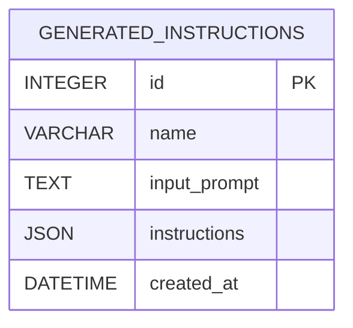

# Модель данных и СУБД в проекте AI Architect

Автор: Алексей Марышев
Проект: AI-архитектор для генерации инструкций 3D‑моделирования

---

## 2. Сущности, связи, атрибуты и ключи

### 2.1. Сущности текущей реализации (MVP)

- GeneratedInstruction — запись о сгенерированной AI архитектурной концепции
  - id (INTEGER, PK) — первичный ключ, уникально идентифицирует запись
  - name (STRING) — краткое человекочитаемое имя (используется в UI для списка)
  - input_prompt (TEXT) — исходный текстовый запрос пользователя (источник правды)
  - instructions (JSON) — структурированный результат генерации (дерево компонентов/модификаторов)
  - created_at (DATETIME) — момент создания записи (для сортировки и аудита)

Обоснование атрибутов:
- name — повышает удобство навигации в UI; хранить произвольный заголовок дешевле, чем вычислять его каждый раз.
- input_prompt — критически важен для воспроизводимости результата и анализа качества подсказок (prompt engineering).
- instructions (JSON) — сохраняет гибкую структуру, т.к. состав компонентов и полей у разных концепций может отличаться; JSON устраняет частые миграции схему → выгодно на этапе R&D.
- created_at — базовая временная метка для витрин, упорядочивания, аудита.

Ключи и ограничения:
- Первичный ключ: id
- Уникальные/внешние ключи: отсутствуют (в MVP нет зависимых таблиц)
- Индексы: рекомендуется индекс по created_at (для обратной хронологии), по name (поиск по названию)

Связи: в MVP отсутствуют межтабличные связи, т.к. хранение сведено к одной сущности.

### 2.2. Предлагаемая расширенная логическая модель (для масштабирования)

Чтобы обеспечить нормализованное хранение и развитую аналитику, целесообразно выделить следующие сущности и связи:

- Instruction (id, name, input_prompt, created_at, model_name, model_params_hash)
- Component (id, instruction_id → Instruction.id, name, type, pos_x, pos_y, pos_z, scale_x, scale_y, scale_z, rot_x, rot_y, rot_z, material_id → Material.id NULLABLE)
- Modifier (id, component_id → Component.id, type, params_json)
- Material (id, name, category)
- Style (id, name)
- InstructionStyle (instruction_id → Instruction.id, style_id → Style.id) — связь M:N

Виды связей:
- Instruction 1:M Component (одна концепция включает много компонентов)
- Component 1:M Modifier (один компонент может иметь много модификаторов)
- Instruction M:N Style (одна концепция может относиться к нескольким стилям; реализуется через таблицу‑связку)
- Component M:1 Material (многие компоненты могут ссылаться на один материал)

Ключи:
- PK на каждой сущности (id)
- FK: Component.instruction_id, Modifier.component_id, Component.material_id, InstructionStyle.*
- Уникальные ограничения по справочникам: Material.name, Style.name

Обоснование:
- Выделение Component/Modifier позволяет агрегировать статистику (например, «какие примитивы чаще всего используются»), делать выборки по типам, материалам и т.п.
- Справочники материалов и стилей убирают дублирование строк и повышают целостность (domain integrity).

---

## 3. Логическая модель данных: средства и построение

Средства:
- Описание сущностей в виде ER‑модели (например, с использованием нотации Crow’s Foot или Mermaid для визуализаций)
- Программная логическая модель реализована через ORM SQLAlchemy (Python), файл src/database/models.py

Упрощённая ER‑модель (расширённый вариант) понятиями:
- Instruction ⟶ Component (1:M)
- Component ⟶ Modifier (1:M)
- Instruction ⟷ Style (M:N через InstructionStyle)
- Component ⟶ Material (M:1)

В текущем MVP логическая модель сведена к одной таблице GeneratedInstruction, что отражает исследовательский (R&D) этап и потребность в гибком JSON.

---

## 4. Нормализация данных

Подход:
- MVP хранит сложную и вариативную структуру в JSON (instructions). Это осознанный компромисс ради скорости итераций и поддержки разных форматов выхода от AI. Формально это отклонение от 3НФ (часть данных денормализована в JSON‑документе).
- Для Production‑этапа предлагается нормализовать модель как в п. 2.2:
  1. 1НФ — атомарность полей: координаты/масштабы/повороты выделяются в отдельные числовые столбцы Component; списки модификаторов — в таблицу Modifier.
  2. 2НФ — исключить частичную зависимость от составных ключей: ключи простые (id), все неключевые атрибуты зависят от id.
  3. 3НФ — устранить транзитивные зависимости: справочники Style и Material исключают повторение «имени материала» в Component.

Итог: MVP оптимален для гибкости (AI‑R&D), расширенная схема — оптимальна для аналитики, отчётности и интеграций.

---

## 5. Физическая модель: средства и построение

Средства реализации:
- СУБД: SQLite (локальная, file‑based)
- ORM: SQLAlchemy 2.x
- Инициализация: функция init_db() в src/database/connection.py (создание таблиц по метаданным моделей)
- Путь к файлу БД: data/architect.db (задаётся через переменную окружения DATABASE_URL)

DDL MVP (эквивалент SQL):

CREATE TABLE generated_instructions (
    id INTEGER PRIMARY KEY AUTOINCREMENT,
    name VARCHAR(255),
    input_prompt TEXT NOT NULL,
    instructions JSON NOT NULL,
    created_at DATETIME DEFAULT CURRENT_TIMESTAMP
);

Рекомендации по индексам:
- CREATE INDEX ix_generated_instructions_created_at ON generated_instructions(created_at DESC);
- CREATE INDEX ix_generated_instructions_name ON generated_instructions(name);

Миграции (при расширении схемы): рекомендовано Alembic.

---

## 6. Языки запросов и примеры

Используемые языки/средства:
- SQL (DDL/DML) — через SQLAlchemy, при необходимости raw SQL
- ORM‑запросы SQLAlchemy (предпочтительно в приложении)

Примеры:

6.1. Вставка (ORM):

new_entry = GeneratedInstruction(
    name="Современный дом (панорама)",
    input_prompt="современный двухэтажный дом, стекло, бетон",
    instructions={"object_type": "building", "components": []}
)
session.add(new_entry)
session.commit()

6.2. Выборка последних N записей (ORM):

rows = (
    session.query(GeneratedInstruction)
    .order_by(GeneratedInstruction.created_at.desc())
    .limit(10)
    .all()
)

6.3. Поиск по названию (ORM):

q = "%дом%"
rows = (
    session.query(GeneratedInstruction)
    .filter(GeneratedInstruction.name.ilike(q))
    .all()
)

6.4. Пример raw SQL (через SQLAlchemy):

from sqlalchemy import text
res = session.execute(text(
    "SELECT id, name, created_at FROM generated_instructions ORDER BY created_at DESC LIMIT :n"
), {"n": 5}).fetchall()

6.5. Отчёт по датам (группировка, raw SQL):

res = session.execute(text(
    """
    SELECT date(created_at) AS d, COUNT(*) AS cnt
    FROM generated_instructions
    GROUP BY date(created_at)
    ORDER BY d DESC
    """
)).fetchall()

---

## 7. ER-диаграммы (Mermaid)

### 7.1. MVP (одна таблица)



### 7.2. Расширенная нормализованная модель

```mermaid
erDiagram
    INSTRUCTION {
        INTEGER id PK
        VARCHAR name
        TEXT input_prompt
        VARCHAR model_name
        VARCHAR model_params_hash
        DATETIME created_at
    }
    COMPONENT {
        INTEGER id PK
        INTEGER instruction_id FK
        VARCHAR name
        VARCHAR type
        REAL pos_x
        REAL pos_y
        REAL pos_z
        REAL scale_x
        REAL scale_y
        REAL scale_z
        REAL rot_x
        REAL rot_y
        REAL rot_z
        INTEGER material_id FK
    }
    MODIFIER {
        INTEGER id PK
        INTEGER component_id FK
        VARCHAR type
        JSON params_json
    }
    MATERIAL {
        INTEGER id PK
        VARCHAR name UNIQUE
        VARCHAR category
    }
    STYLE {
        INTEGER id PK
        VARCHAR name UNIQUE
    }
    INSTRUCTIONSTYLE {
        INTEGER instruction_id FK
        INTEGER style_id FK
        PK "instruction_id, style_id"
    }

    INSTRUCTION ||--o{ COMPONENT : contains
    COMPONENT ||--o{ MODIFIER : has
    COMPONENT }o--|| MATERIAL : uses
    INSTRUCTION ||--o{ INSTRUCTIONSTYLE : tags
    STYLE ||--o{ INSTRUCTIONSTYLE : tags
```

---

## 8. Миграции с Alembic (пошагово)

Alembic позволяет версионировать схему БД, автоматически генерировать миграции по изменениям моделей SQLAlchemy и применять их.

### 8.1. Установка

```powershell
# из корня проекта
.\venv\Scripts\Activate.ps1
pip install alembic
```

### 8.2. Инициализация Alembic

```powershell
alembic init alembic
```

В корне появится папка `alembic/` и файл `alembic.ini`.

### 8.3. Настройка alembic.ini

Откройте `alembic.ini` и укажите URL БД (или оставьте пустым — URL будет подтягиваться из .env):

```
# Вариант 1 (жестко):
sqlalchemy.url = sqlite:///data/architect.db

# Вариант 2 (рекомендуется): оставить пустым, URL установим в env.py через .env
sqlalchemy.url = 
```

### 8.4. Настройка alembic/env.py

Добавьте в начало файла:

```python
from dotenv import load_dotenv
import os
load_dotenv()
```

Импортируйте метаданные моделей и установите URL при запуске:

```python
from src.database.connection import Base

config = context.config
if not config.get_main_option("sqlalchemy.url"):
    db_url = os.getenv("DATABASE_URL", "sqlite:///data/architect.db")
    config.set_main_option("sqlalchemy.url", db_url)

target_metadata = Base.metadata
```

Теперь Alembic знает, какие таблицы создавать и где находится БД.

### 8.5. Генерация первой миграции (для текущего MVP)

```powershell
alembic revision --autogenerate -m "init mvp: generated_instructions"
```

Проверьте файл миграции в `alembic/versions/` — там будут DDL-операции создания таблицы.

### 8.6. Применение миграций

```powershell
alembic upgrade head
```

### 8.7. Изменение модели и новые миграции

1) Внесите изменения в `src/database/models.py` (например, добавьте поле).  
2) Сгенерируйте новую миграцию:

```powershell
alembic revision --autogenerate -m "add column X to generated_instructions"
```

3) Примените:

```powershell
alembic upgrade head
```

### 8.8. Откат миграций

```powershell
alembic downgrade -1   # на одну версию назад
alembic downgrade base # в самое начало
```

---

## 9. DDL расширенной нормализованной схемы (пример SQL)

```sql
CREATE TABLE instruction (
    id INTEGER PRIMARY KEY AUTOINCREMENT,
    name VARCHAR(255),
    input_prompt TEXT NOT NULL,
    model_name VARCHAR(100),
    model_params_hash VARCHAR(128),
    created_at DATETIME DEFAULT CURRENT_TIMESTAMP
);

CREATE TABLE material (
    id INTEGER PRIMARY KEY AUTOINCREMENT,
    name VARCHAR(100) NOT NULL UNIQUE,
    category VARCHAR(100)
);

CREATE TABLE style (
    id INTEGER PRIMARY KEY AUTOINCREMENT,
    name VARCHAR(100) NOT NULL UNIQUE
);

CREATE TABLE component (
    id INTEGER PRIMARY KEY AUTOINCREMENT,
    instruction_id INTEGER NOT NULL REFERENCES instruction(id) ON DELETE CASCADE,
    name VARCHAR(255),
    type VARCHAR(50) NOT NULL,
    pos_x REAL DEFAULT 0, pos_y REAL DEFAULT 0, pos_z REAL DEFAULT 0,
    scale_x REAL DEFAULT 1, scale_y REAL DEFAULT 1, scale_z REAL DEFAULT 1,
    rot_x REAL DEFAULT 0, rot_y REAL DEFAULT 0, rot_z REAL DEFAULT 0,
    material_id INTEGER REFERENCES material(id)
);

CREATE TABLE modifier (
    id INTEGER PRIMARY KEY AUTOINCREMENT,
    component_id INTEGER NOT NULL REFERENCES component(id) ON DELETE CASCADE,
    type VARCHAR(50) NOT NULL,
    params_json JSON
);

CREATE TABLE instruction_style (
    instruction_id INTEGER NOT NULL REFERENCES instruction(id) ON DELETE CASCADE,
    style_id INTEGER NOT NULL REFERENCES style(id) ON DELETE CASCADE,
    PRIMARY KEY (instruction_id, style_id)
);

CREATE INDEX ix_instruction_created_at ON instruction (created_at DESC);
CREATE INDEX ix_component_instruction ON component (instruction_id);
CREATE INDEX ix_modifier_component ON modifier (component_id);
```

---

## Заключение

- Текущая физическая модель (MVP) ориентирована на гибкость и скорость итераций: сложная структура хранится в JSON.
- Предложенная расширенная логическая модель позволяет легко перейти к нормализованной схеме с полноценными связями и аналитикой.
- Использование SQLAlchemy упрощает эволюцию модели и переносимость между СУБД (SQLite → PostgreSQL).